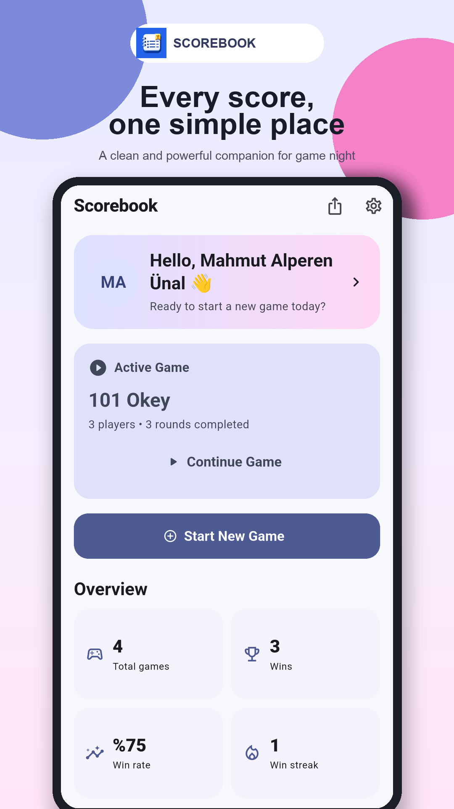
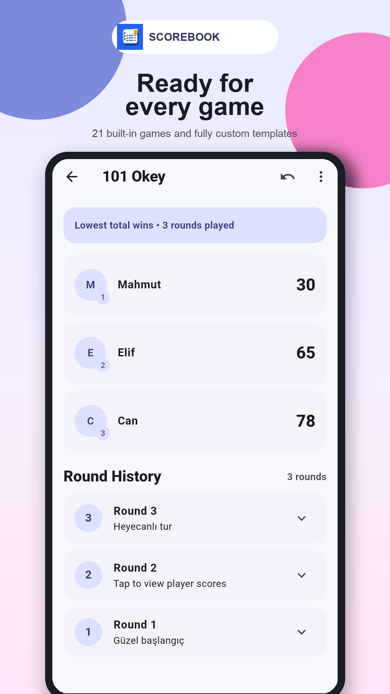
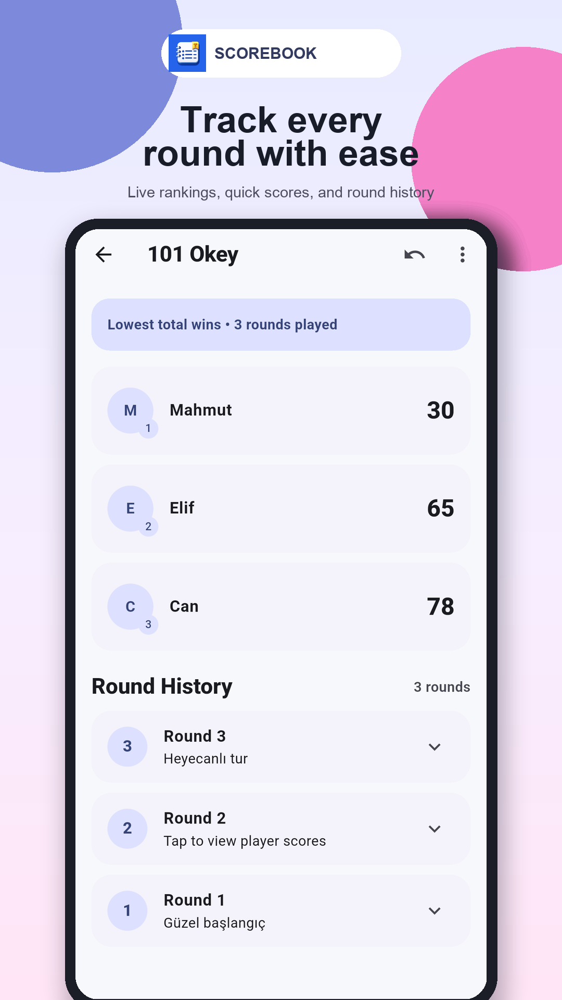
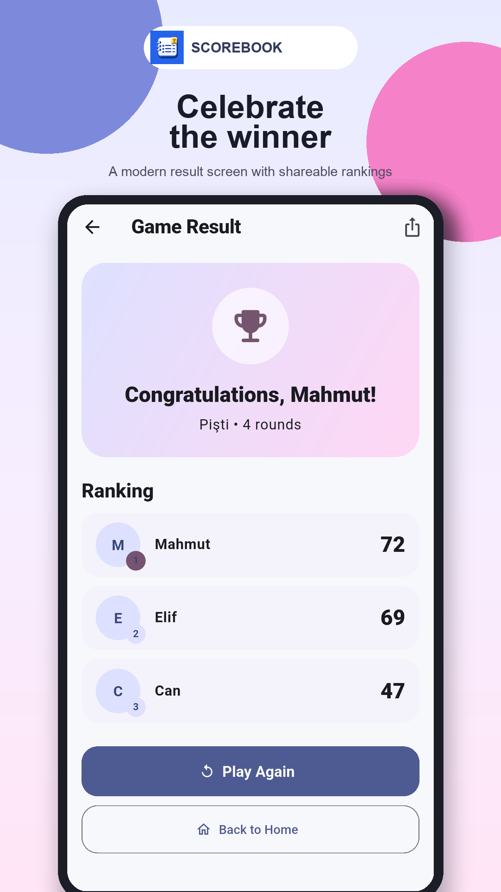

# Scorebook (Skor Defteri)

Scorebook is a privacy-first, offline scorekeeping and game-history application for board games, card games, and custom game nights. It provides structured round tracking, player statistics, reusable game templates, local backups, and cross-device game transfer without requiring an account or an internet connection.

The application is built with Flutter and targets both Android and iOS.

## Screenshots

  
  
  
  

Localized store assets and original in-app captures are available under:

- [`assets/store/android/en`](assets/store/android/en) — English marketing assets
- [`assets/store/android/tr`](assets/store/android/tr) — Turkish marketing assets
- [`assets/screenshots/android`](assets/screenshots/android) — original in-app screenshots

## Key Features

### Scorekeeping

- Round-based score entry with optional round notes
- High-score-wins and low-score-wins rule sets
- Quick-score shortcuts and negative-score support
- Undo support for the latest round
- Manual, target-score, and fixed-round completion modes
- Live rankings, cumulative totals, and detailed round history
- Animated result screen with shareable final standings

### Players and Friends

- Local profile with username, name, and optional profile photo
- Reusable friend profiles with favorites and archiving
- Per-player game, win, loss, and win-rate statistics
- Temporary guest players for one-off game sessions
- Fast participant selection when starting a game

### Game Library

- 21 built-in templates for popular board, tile, card, and table games
- Searchable, categorized game catalog
- Custom game creation with configurable scoring and completion rules
- Localized built-in game names, descriptions, and categories

### Dashboard and History

- Active-game continuation from the home screen
- Total games, wins, win rate, and current streak overview
- Local gameplay insights based on completed sessions
- Complete game history and a local all-player leaderboard

### Backup and Transfer

- Full local backup and restore using `.skordefteri` files
- Active-game transfer using `.skoroyun` files
- Native system sharing through messaging, email, AirDrop, or Nearby Share
- Atomic JSON persistence to reduce the risk of partial writes
- Automatic migration from the legacy v1 player schema to the v2 profile/friend schema

### Personalization and Accessibility

- Light, dark, and system theme modes
- Reduced-motion preference
- English and Turkish localization
- System-language detection with an explicit in-app language override
- Localized Android application name and iOS permission descriptions

## Privacy Model

Scorebook is designed to work without accounts, analytics, advertising SDKs, or cloud storage.

- Profile, friend, photo-path, game, and score data remain on the device.
- Data leaves the device only when the user explicitly starts a share, backup, or transfer action.
- The application does not require network access for its core functionality.
- All local data can be permanently deleted from the Settings screen.

Privacy policy documents:

- [English privacy policy](docs/privacy_policy_en.md)
- [Turkish privacy policy](docs/privacy_policy_tr.md)

## Technical Overview

| Area | Technology |
| --- | --- |
| UI framework | Flutter / Material 3 |
| Language | Dart 3.8+ |
| State management | Riverpod 3 |
| Navigation | GoRouter |
| Persistence | Local JSON repository with atomic writes |
| Localization | Flutter ARB generation plus localized template catalogs |
| File transfer | File Picker, Share Plus, and Cross File |
| Media | Image Picker |
| Supported platforms | Android and iOS |

## Localization

User-facing content is available in English and Turkish. The application supports system-locale selection as well as a persistent manual override.

## Maintainer

Developed and maintained by [Mahmut Alperen Ünal](https://github.com/mahmutaunal) under [AlpWare Studio](https://www.alpwarestudio.com).
